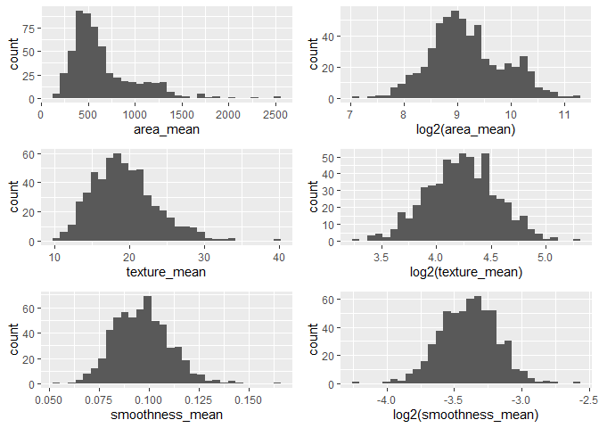
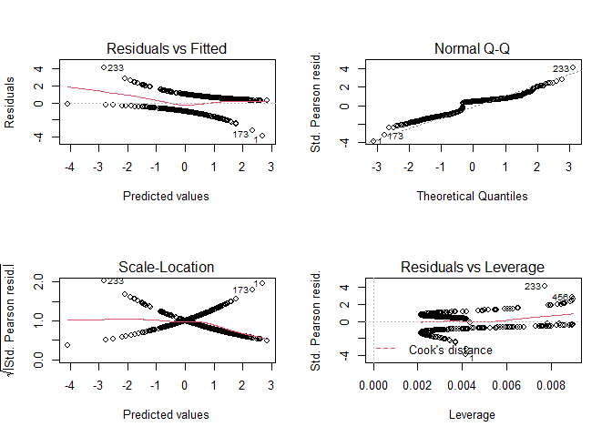
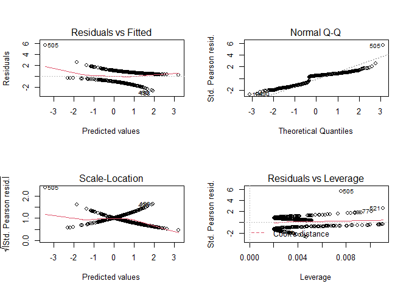
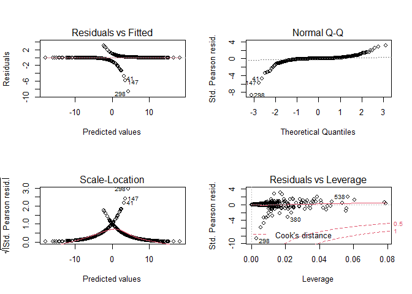
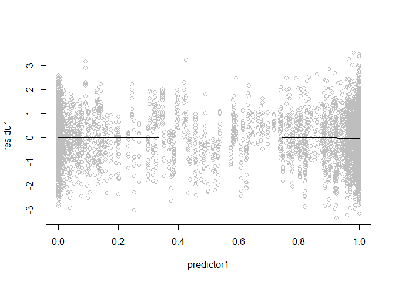

Modele liniowe cancer
================
Grzegorz Kuriata
18 06 2022

``` r
library(dplyr)
```

    ## 
    ## Attaching package: 'dplyr'

    ## The following objects are masked from 'package:stats':
    ## 
    ##     filter, lag

    ## The following objects are masked from 'package:base':
    ## 
    ##     intersect, setdiff, setequal, union

``` r
library(ggplot2)
```

    ## Warning: package 'ggplot2' was built under R version 4.0.5

``` r
library(tidyr)
library(gridExtra)
```

    ## Warning: package 'gridExtra' was built under R version 4.0.5

    ## 
    ## Attaching package: 'gridExtra'

    ## The following object is masked from 'package:dplyr':
    ## 
    ##     combine

``` r
library(ResourceSelection)
```

    ## Warning: package 'ResourceSelection' was built under R version 4.0.5

    ## ResourceSelection 0.3-5   2019-07-22

``` r
library(statmod)
```

    ## Warning: package 'statmod' was built under R version 4.0.5

``` r
cancer <- read.csv("cancer.csv")
```

Będziemy zajmować się zbiorem danych zawierającym 569 obserwacji. Badano
diagnozę raka piersi przez wzgląd na różne czynniki. Na początku
spójrzmy na opis naszych predyktorów.

| Nazwa zmiennej    | Opis                                                                                   |
|-------------------|----------------------------------------------------------------------------------------|
| `diagnosis`       | Diagnoza (M - złośliwy, B - łagodny)                                                   |
| `area_mean`       | Średni obszar jądra komórkowego                                                        |
| `texture_mean`    | Średnia tekstura (odchylenie standardowe od wartości skali szarości) jądra komórkowego |
| `smoothness_mean` | gładkość (lokalna zmienność długości promieni) jądra komórkowego                       |

``` r
str(cancer)
```

    ## 'data.frame':    569 obs. of  33 variables:
    ##  $ id                     : int  842302 842517 84300903 84348301 84358402 843786 844359 84458202 844981 84501001 ...
    ##  $ diagnosis              : chr  "M" "M" "M" "M" ...
    ##  $ radius_mean            : num  18 20.6 19.7 11.4 20.3 ...
    ##  $ texture_mean           : num  10.4 17.8 21.2 20.4 14.3 ...
    ##  $ perimeter_mean         : num  122.8 132.9 130 77.6 135.1 ...
    ##  $ area_mean              : num  1001 1326 1203 386 1297 ...
    ##  $ smoothness_mean        : num  0.1184 0.0847 0.1096 0.1425 0.1003 ...
    ##  $ compactness_mean       : num  0.2776 0.0786 0.1599 0.2839 0.1328 ...
    ##  $ concavity_mean         : num  0.3001 0.0869 0.1974 0.2414 0.198 ...
    ##  $ concave.points_mean    : num  0.1471 0.0702 0.1279 0.1052 0.1043 ...
    ##  $ symmetry_mean          : num  0.242 0.181 0.207 0.26 0.181 ...
    ##  $ fractal_dimension_mean : num  0.0787 0.0567 0.06 0.0974 0.0588 ...
    ##  $ radius_se              : num  1.095 0.543 0.746 0.496 0.757 ...
    ##  $ texture_se             : num  0.905 0.734 0.787 1.156 0.781 ...
    ##  $ perimeter_se           : num  8.59 3.4 4.58 3.44 5.44 ...
    ##  $ area_se                : num  153.4 74.1 94 27.2 94.4 ...
    ##  $ smoothness_se          : num  0.0064 0.00522 0.00615 0.00911 0.01149 ...
    ##  $ compactness_se         : num  0.049 0.0131 0.0401 0.0746 0.0246 ...
    ##  $ concavity_se           : num  0.0537 0.0186 0.0383 0.0566 0.0569 ...
    ##  $ concave.points_se      : num  0.0159 0.0134 0.0206 0.0187 0.0188 ...
    ##  $ symmetry_se            : num  0.03 0.0139 0.0225 0.0596 0.0176 ...
    ##  $ fractal_dimension_se   : num  0.00619 0.00353 0.00457 0.00921 0.00511 ...
    ##  $ radius_worst           : num  25.4 25 23.6 14.9 22.5 ...
    ##  $ texture_worst          : num  17.3 23.4 25.5 26.5 16.7 ...
    ##  $ perimeter_worst        : num  184.6 158.8 152.5 98.9 152.2 ...
    ##  $ area_worst             : num  2019 1956 1709 568 1575 ...
    ##  $ smoothness_worst       : num  0.162 0.124 0.144 0.21 0.137 ...
    ##  $ compactness_worst      : num  0.666 0.187 0.424 0.866 0.205 ...
    ##  $ concavity_worst        : num  0.712 0.242 0.45 0.687 0.4 ...
    ##  $ concave.points_worst   : num  0.265 0.186 0.243 0.258 0.163 ...
    ##  $ symmetry_worst         : num  0.46 0.275 0.361 0.664 0.236 ...
    ##  $ fractal_dimension_worst: num  0.1189 0.089 0.0876 0.173 0.0768 ...
    ##  $ X                      : logi  NA NA NA NA NA NA ...

Zmienna `diagnosis` jest zmienną charakterystyczną, więc zmieniamy ją na
liczbową.

``` r
cancer <- cancer %>% mutate(diagnosis = as.integer(ifelse(diagnosis == "M", "0", "1")))
```

Podsumujmy nasze dane

``` r
summary(cancer)
```

    ##        id              diagnosis       radius_mean      texture_mean  
    ##  Min.   :     8670   Min.   :0.0000   Min.   : 6.981   Min.   : 9.71  
    ##  1st Qu.:   869218   1st Qu.:0.0000   1st Qu.:11.700   1st Qu.:16.17  
    ##  Median :   906024   Median :1.0000   Median :13.370   Median :18.84  
    ##  Mean   : 30371831   Mean   :0.6274   Mean   :14.127   Mean   :19.29  
    ##  3rd Qu.:  8813129   3rd Qu.:1.0000   3rd Qu.:15.780   3rd Qu.:21.80  
    ##  Max.   :911320502   Max.   :1.0000   Max.   :28.110   Max.   :39.28  
    ##  perimeter_mean     area_mean      smoothness_mean   compactness_mean 
    ##  Min.   : 43.79   Min.   : 143.5   Min.   :0.05263   Min.   :0.01938  
    ##  1st Qu.: 75.17   1st Qu.: 420.3   1st Qu.:0.08637   1st Qu.:0.06492  
    ##  Median : 86.24   Median : 551.1   Median :0.09587   Median :0.09263  
    ##  Mean   : 91.97   Mean   : 654.9   Mean   :0.09636   Mean   :0.10434  
    ##  3rd Qu.:104.10   3rd Qu.: 782.7   3rd Qu.:0.10530   3rd Qu.:0.13040  
    ##  Max.   :188.50   Max.   :2501.0   Max.   :0.16340   Max.   :0.34540  
    ##  concavity_mean    concave.points_mean symmetry_mean    fractal_dimension_mean
    ##  Min.   :0.00000   Min.   :0.00000     Min.   :0.1060   Min.   :0.04996       
    ##  1st Qu.:0.02956   1st Qu.:0.02031     1st Qu.:0.1619   1st Qu.:0.05770       
    ##  Median :0.06154   Median :0.03350     Median :0.1792   Median :0.06154       
    ##  Mean   :0.08880   Mean   :0.04892     Mean   :0.1812   Mean   :0.06280       
    ##  3rd Qu.:0.13070   3rd Qu.:0.07400     3rd Qu.:0.1957   3rd Qu.:0.06612       
    ##  Max.   :0.42680   Max.   :0.20120     Max.   :0.3040   Max.   :0.09744       
    ##    radius_se        texture_se      perimeter_se       area_se       
    ##  Min.   :0.1115   Min.   :0.3602   Min.   : 0.757   Min.   :  6.802  
    ##  1st Qu.:0.2324   1st Qu.:0.8339   1st Qu.: 1.606   1st Qu.: 17.850  
    ##  Median :0.3242   Median :1.1080   Median : 2.287   Median : 24.530  
    ##  Mean   :0.4052   Mean   :1.2169   Mean   : 2.866   Mean   : 40.337  
    ##  3rd Qu.:0.4789   3rd Qu.:1.4740   3rd Qu.: 3.357   3rd Qu.: 45.190  
    ##  Max.   :2.8730   Max.   :4.8850   Max.   :21.980   Max.   :542.200  
    ##  smoothness_se      compactness_se      concavity_se     concave.points_se 
    ##  Min.   :0.001713   Min.   :0.002252   Min.   :0.00000   Min.   :0.000000  
    ##  1st Qu.:0.005169   1st Qu.:0.013080   1st Qu.:0.01509   1st Qu.:0.007638  
    ##  Median :0.006380   Median :0.020450   Median :0.02589   Median :0.010930  
    ##  Mean   :0.007041   Mean   :0.025478   Mean   :0.03189   Mean   :0.011796  
    ##  3rd Qu.:0.008146   3rd Qu.:0.032450   3rd Qu.:0.04205   3rd Qu.:0.014710  
    ##  Max.   :0.031130   Max.   :0.135400   Max.   :0.39600   Max.   :0.052790  
    ##   symmetry_se       fractal_dimension_se  radius_worst   texture_worst  
    ##  Min.   :0.007882   Min.   :0.0008948    Min.   : 7.93   Min.   :12.02  
    ##  1st Qu.:0.015160   1st Qu.:0.0022480    1st Qu.:13.01   1st Qu.:21.08  
    ##  Median :0.018730   Median :0.0031870    Median :14.97   Median :25.41  
    ##  Mean   :0.020542   Mean   :0.0037949    Mean   :16.27   Mean   :25.68  
    ##  3rd Qu.:0.023480   3rd Qu.:0.0045580    3rd Qu.:18.79   3rd Qu.:29.72  
    ##  Max.   :0.078950   Max.   :0.0298400    Max.   :36.04   Max.   :49.54  
    ##  perimeter_worst    area_worst     smoothness_worst  compactness_worst
    ##  Min.   : 50.41   Min.   : 185.2   Min.   :0.07117   Min.   :0.02729  
    ##  1st Qu.: 84.11   1st Qu.: 515.3   1st Qu.:0.11660   1st Qu.:0.14720  
    ##  Median : 97.66   Median : 686.5   Median :0.13130   Median :0.21190  
    ##  Mean   :107.26   Mean   : 880.6   Mean   :0.13237   Mean   :0.25427  
    ##  3rd Qu.:125.40   3rd Qu.:1084.0   3rd Qu.:0.14600   3rd Qu.:0.33910  
    ##  Max.   :251.20   Max.   :4254.0   Max.   :0.22260   Max.   :1.05800  
    ##  concavity_worst  concave.points_worst symmetry_worst   fractal_dimension_worst
    ##  Min.   :0.0000   Min.   :0.00000      Min.   :0.1565   Min.   :0.05504        
    ##  1st Qu.:0.1145   1st Qu.:0.06493      1st Qu.:0.2504   1st Qu.:0.07146        
    ##  Median :0.2267   Median :0.09993      Median :0.2822   Median :0.08004        
    ##  Mean   :0.2722   Mean   :0.11461      Mean   :0.2901   Mean   :0.08395        
    ##  3rd Qu.:0.3829   3rd Qu.:0.16140      3rd Qu.:0.3179   3rd Qu.:0.09208        
    ##  Max.   :1.2520   Max.   :0.29100      Max.   :0.6638   Max.   :0.20750        
    ##     X          
    ##  Mode:logical  
    ##  NA's:569      
    ##                
    ##                
    ##                
    ## 

\*Ustalimy czy istnieje asocjacja między diagnozą raka piersi, a
zmiennymi `area_mean`, `texture_mean`, `smoothness_mean`.

\*Sprawdzimy jak zachowują się modele z różną kombinacją predyktorów.

\*Ile zdiagnozowanych osób mających średni obszar jądra komórkowego
większy niż 800 ma większą szansę na diagnozę złośliwego raka piersi, a
ile poniżej ?

W tym momencie sprawdźmy jak wygladają rozkłady naszych zmiennych. W tym
miejscu tworzymy histogramy jak również histogramy, w których
logarytmujemy nasze predyktory, żeby od razu móc zobaczyć, czy wykresy
się poprawią.

``` r
rad <- ggplot(data = cancer, aes(x = area_mean)) + geom_histogram()
rad_log <- ggplot(data = cancer, aes(x = log2(area_mean))) + geom_histogram()
tex <- ggplot(data = cancer, aes(x = texture_mean)) + geom_histogram()
tex_log <- ggplot(data = cancer, aes(x = log2(texture_mean))) + geom_histogram()
smo <- ggplot(data = cancer, aes(x = smoothness_mean)) + geom_histogram()
smo_log <- ggplot(data = cancer, aes(x = log2(smoothness_mean))) + geom_histogram()

grid.arrange(rad, rad_log, tex, tex_log,smo,smo_log, nrow=3)
```

    ## `stat_bin()` using `bins = 30`. Pick better value with `binwidth`.
    ## `stat_bin()` using `bins = 30`. Pick better value with `binwidth`.
    ## `stat_bin()` using `bins = 30`. Pick better value with `binwidth`.
    ## `stat_bin()` using `bins = 30`. Pick better value with `binwidth`.
    ## `stat_bin()` using `bins = 30`. Pick better value with `binwidth`.
    ## `stat_bin()` using `bins = 30`. Pick better value with `binwidth`.

<!-- -->

Wniosek: Nałożenie logarytmu na nasze zmienne dały poprawe dla zmiennej
`area_mean` oraz `texture_mean` i nieznacznie dla zmiennej
`smoothness_mean`. Budując modele będziemy zwracać uwagę, czy zmienne
zlogarytmowane poprawią wyniki modelu.

Patrząc na nieprzekształcony histogram zmiennej ‘area\_mean’ odpowiedzmy
sobie na pytanie, ile osób .

``` r
wpow_750 <- cancer[which(cancer$area_mean >= 800 & cancer$diagnosis == 1), ]

length(wpow_750$diagnosis)
```

    ## [1] 5

Jest 5 osób, które mają większą szansę na łagodnego raka piersi i ich
średni obszar jądra komórkowego jest większy niż 800.

``` r
wpow_750 <- cancer[which(cancer$area_mean >= 800 & cancer$diagnosis == 0), ]

length(wpow_750$diagnosis)
```

    ## [1] 133

Są 133 osoby, które mają większą szansę na złośliwego raka piersi i ich
średni obszar jądra komórkowego jest większy niż 800.

``` r
wpon_750 <- cancer[which(cancer$area_mean < 800 & cancer$diagnosis == 1), ]

length(wpon_750$diagnosis)
```

    ## [1] 352

Są 352 osoby, które mają większą szansę na łagodnego raka piersi i ich
średni obszar jądra komórkowego jest wmniejszy niż 800.

``` r
wpon_750 <- cancer[which(cancer$area_mean < 800 & cancer$diagnosis == 0), ]

length(wpon_750$diagnosis)
```

    ## [1] 79

Jest 79 osób, które mają większą szansę na złośliwego raka piersi i ich
średni obszar jądra komórkowego jest mniejszy niż 800.

``` r
procent<- 113/(5+113)*100
procent
```

    ## [1] 95.76271

``` r
procent2<-79/(352+79)*100
procent2
```

    ## [1] 18.32947

Wniosek: Około 95,8% osób mających średni obszar jądra komórkowego
większy lub równy 800 mają większą szansę na diagnozę złośliwego raka
piersi, natomiast poniżej około 18,3%.

Teraz zbudujemy modele.

``` r
model_area <- glm(diagnosis~area_mean, data = cancer, family = "binomial")
summary(model_area)
```

    ## 
    ## Call:
    ## glm(formula = diagnosis ~ area_mean, family = "binomial", data = cancer)
    ## 
    ## Deviance Residuals: 
    ##      Min        1Q    Median        3Q       Max  
    ## -2.73598  -0.09862   0.20420   0.46420   2.72957  
    ## 
    ## Coefficients:
    ##             Estimate Std. Error z value Pr(>|z|)    
    ## (Intercept)  7.97409    0.68286   11.68   <2e-16 ***
    ## area_mean   -0.01177    0.00109  -10.80   <2e-16 ***
    ## ---
    ## Signif. codes:  0 '***' 0.001 '**' 0.01 '*' 0.05 '.' 0.1 ' ' 1
    ## 
    ## (Dispersion parameter for binomial family taken to be 1)
    ## 
    ##     Null deviance: 751.44  on 568  degrees of freedom
    ## Residual deviance: 325.66  on 567  degrees of freedom
    ## AIC: 329.66
    ## 
    ## Number of Fisher Scoring iterations: 7

``` r
model_texture <- glm(diagnosis~texture_mean, data = cancer, family = "binomial")
summary(model_texture)
```

    ## 
    ## Call:
    ## glm(formula = diagnosis ~ texture_mean, family = "binomial", 
    ##     data = cancer)
    ## 
    ## Deviance Residuals: 
    ##     Min       1Q   Median       3Q      Max  
    ## -2.3477  -1.1022   0.5881   0.8451   2.3942  
    ## 
    ## Coefficients:
    ##              Estimate Std. Error z value Pr(>|z|)    
    ## (Intercept)   5.12577    0.52638   9.738   <2e-16 ***
    ## texture_mean -0.23464    0.02614  -8.975   <2e-16 ***
    ## ---
    ## Signif. codes:  0 '***' 0.001 '**' 0.01 '*' 0.05 '.' 0.1 ' ' 1
    ## 
    ## (Dispersion parameter for binomial family taken to be 1)
    ## 
    ##     Null deviance: 751.44  on 568  degrees of freedom
    ## Residual deviance: 646.52  on 567  degrees of freedom
    ## AIC: 650.52
    ## 
    ## Number of Fisher Scoring iterations: 4

``` r
model_smoothness <- glm(diagnosis~smoothness_mean, data = cancer, family = "binomial")
summary(model_smoothness)
```

    ## 
    ## Call:
    ## glm(formula = diagnosis ~ smoothness_mean, family = "binomial", 
    ##     data = cancer)
    ## 
    ## Deviance Residuals: 
    ##     Min       1Q   Median       3Q      Max  
    ## -2.0404  -1.1428   0.6357   0.9148   2.6352  
    ## 
    ## Coefficients:
    ##                 Estimate Std. Error z value Pr(>|z|)    
    ## (Intercept)       6.3773     0.7474   8.532  < 2e-16 ***
    ## smoothness_mean -60.0857     7.5497  -7.959 1.74e-15 ***
    ## ---
    ## Signif. codes:  0 '***' 0.001 '**' 0.01 '*' 0.05 '.' 0.1 ' ' 1
    ## 
    ## (Dispersion parameter for binomial family taken to be 1)
    ## 
    ##     Null deviance: 751.44  on 568  degrees of freedom
    ## Residual deviance: 673.95  on 567  degrees of freedom
    ## AIC: 677.95
    ## 
    ## Number of Fisher Scoring iterations: 3

Dewiancja wynosi 751.44 i jest większa od 568 stopni swobody. Może to
świadczyć o zjawisku nadmiernej dyspersji lub niedopasowaniu modeli.
Jednakże, na razie się tym nie przejmujemy, ponieważ końcowy model
będzie zawierał więcej niż jeden predyktor. Zauważmy także, że AIC jest
prawie dwa razy mniejsze dla modelu ze zmienną `area_mean` niż dla
pozostałych. To może oznaczać, że zmienna `area_mean` lepiej definiuje
model niż pozostałe dwie.

Zobaczmy jak wyglądają wykresy diagnostyczne modelu ze zmiennymi z
większym AIC.

``` r
par(mfrow=c(2,2))
plot(model_texture)
```

<!-- -->

``` r
par(mfrow=c(2,2))
plot(model_smoothness)
```

<!-- -->

Jak możemy zauważyć, modele te nie są najlepiej dopasowane, ale nie są
też źle dopasowane.

Zobaczmy jak będzie wyglądał końcowy model.

``` r
model1<-glm(diagnosis~area_mean+smoothness_mean+texture_mean, data = cancer, family = "binomial")
```

    ## Warning: glm.fit: fitted probabilities numerically 0 or 1 occurred

``` r
summary(model1)
```

    ## 
    ## Call:
    ## glm(formula = diagnosis ~ area_mean + smoothness_mean + texture_mean, 
    ##     family = "binomial", data = cancer)
    ## 
    ## Deviance Residuals: 
    ##      Min        1Q    Median        3Q       Max  
    ## -2.85800  -0.01878   0.04419   0.20032   2.14463  
    ## 
    ## Coefficients:
    ##                   Estimate Std. Error z value Pr(>|z|)    
    ## (Intercept)      3.262e+01  3.608e+00   9.040  < 2e-16 ***
    ## area_mean       -1.626e-02  1.827e-03  -8.901  < 2e-16 ***
    ## smoothness_mean -1.468e+02  1.922e+01  -7.636 2.25e-14 ***
    ## texture_mean    -3.811e-01  5.768e-02  -6.607 3.92e-11 ***
    ## ---
    ## Signif. codes:  0 '***' 0.001 '**' 0.01 '*' 0.05 '.' 0.1 ' ' 1
    ## 
    ## (Dispersion parameter for binomial family taken to be 1)
    ## 
    ##     Null deviance: 751.44  on 568  degrees of freedom
    ## Residual deviance: 182.53  on 565  degrees of freedom
    ## AIC: 190.53
    ## 
    ## Number of Fisher Scoring iterations: 8

Wykonajmy jeszcze test Hosmera-Lameshowa.

``` r
hoslem.test(cancer$diagnosis, fitted(model1))
```

    ## 
    ##  Hosmer and Lemeshow goodness of fit (GOF) test
    ## 
    ## data:  cancer$diagnosis, fitted(model1)
    ## X-squared = 2.4548, df = 8, p-value = 0.9638

Wygląda na to, że ten model jest dobrze dopasowany. Sprawdźmy jeszcze
modele ze zlogarytmowanymi zmiennymi `area_mean` oraz `texture_mean`.

``` r
model2 <- glm(diagnosis~log2(area_mean)+smoothness_mean+texture_mean, data = cancer, family = "binomial")
summary(model2)
```

    ## 
    ## Call:
    ## glm(formula = diagnosis ~ log2(area_mean) + smoothness_mean + 
    ##     texture_mean, family = "binomial", data = cancer)
    ## 
    ## Deviance Residuals: 
    ##      Min        1Q    Median        3Q       Max  
    ## -2.94694  -0.05546   0.03082   0.17242   2.18787  
    ## 
    ## Coefficients:
    ##                   Estimate Std. Error z value Pr(>|z|)    
    ## (Intercept)       86.67425    9.08267   9.543  < 2e-16 ***
    ## log2(area_mean)   -6.88367    0.75546  -9.112  < 2e-16 ***
    ## smoothness_mean -153.10345   20.19279  -7.582 3.40e-14 ***
    ## texture_mean      -0.37700    0.05757  -6.549 5.81e-11 ***
    ## ---
    ## Signif. codes:  0 '***' 0.001 '**' 0.01 '*' 0.05 '.' 0.1 ' ' 1
    ## 
    ## (Dispersion parameter for binomial family taken to be 1)
    ## 
    ##     Null deviance: 751.44  on 568  degrees of freedom
    ## Residual deviance: 183.07  on 565  degrees of freedom
    ## AIC: 191.07
    ## 
    ## Number of Fisher Scoring iterations: 8

``` r
hoslem.test(cancer$diagnosis, fitted(model2))
```

    ## 
    ##  Hosmer and Lemeshow goodness of fit (GOF) test
    ## 
    ## data:  cancer$diagnosis, fitted(model2)
    ## X-squared = 2.2495, df = 8, p-value = 0.9724

Ten model także jest dobrze dopasowany.

``` r
model3 <- glm(diagnosis~log2(area_mean)+smoothness_mean+log2(texture_mean), data = cancer, family = "binomial")
summary(model3)
```

    ## 
    ## Call:
    ## glm(formula = diagnosis ~ log2(area_mean) + smoothness_mean + 
    ##     log2(texture_mean), family = "binomial", data = cancer)
    ## 
    ## Deviance Residuals: 
    ##      Min        1Q    Median        3Q       Max  
    ## -2.94099  -0.04745   0.02426   0.16153   2.15951  
    ## 
    ## Coefficients:
    ##                     Estimate Std. Error z value Pr(>|z|)    
    ## (Intercept)         105.1482    11.1527   9.428  < 2e-16 ***
    ## log2(area_mean)      -7.0401     0.7858  -8.959  < 2e-16 ***
    ## smoothness_mean    -159.9694    21.3200  -7.503 6.23e-14 ***
    ## log2(texture_mean)   -5.5672     0.8364  -6.656 2.81e-11 ***
    ## ---
    ## Signif. codes:  0 '***' 0.001 '**' 0.01 '*' 0.05 '.' 0.1 ' ' 1
    ## 
    ## (Dispersion parameter for binomial family taken to be 1)
    ## 
    ##     Null deviance: 751.44  on 568  degrees of freedom
    ## Residual deviance: 174.88  on 565  degrees of freedom
    ## AIC: 182.88
    ## 
    ## Number of Fisher Scoring iterations: 8

``` r
hoslem.test(cancer$diagnosis, fitted(model3))
```

    ## 
    ##  Hosmer and Lemeshow goodness of fit (GOF) test
    ## 
    ## data:  cancer$diagnosis, fitted(model3)
    ## X-squared = 1.3209, df = 8, p-value = 0.9953

Patrząc na p-value, które w teście Hosmera-Lameshowa powinno być jak
najwyższe okazuje się, że model ze zlogarytmowanymi zmiennymi
`area_mean` oraz `texture_mean`wydaje się być najlepszym modelem.

Ostatecznie modelem końcowym zostaje “model3”. Sprawdźmy jak wyglądają
jego wykresy diagnostyczne.

``` r
par(mfrow=c(2,2))
plot(model3)
```

<!-- -->

Wykresy diagnostyczne potwierdzają nasze przypuszczenia, model ten jest
dobrze dopasowany.

``` r
residu1 = c()
predictor1 = c()
for (i in 1:10) {
  res <- qresid(model3)
  pred <- predict(model2, type='response')
  residu1 = c(residu1, res)
  predictor1 = c(predictor1, pred)
  
}
scatter.smooth(predictor1, residu1, col='gray')
```

<!-- -->

Reszty kwantylowe pozwalają na lepszą diagnostykę modelu. Możemy
zaobserwować dobre dopasowanie modelu, co potwierdza poprzednie testy.
