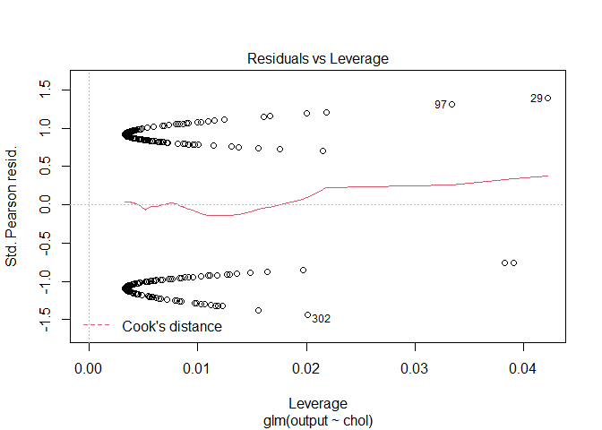

Modele liniowe heart
================
19 06 2022

``` r
library(dplyr)
```

    ## 
    ## Attaching package: 'dplyr'

    ## The following objects are masked from 'package:stats':
    ## 
    ##     filter, lag

    ## The following objects are masked from 'package:base':
    ## 
    ##     intersect, setdiff, setequal, union

``` r
library(ggplot2)
```

    ## Warning: package 'ggplot2' was built under R version 4.0.5

``` r
library(tidyr)
library(gridExtra)
```

    ## Warning: package 'gridExtra' was built under R version 4.0.5

    ## 
    ## Attaching package: 'gridExtra'

    ## The following object is masked from 'package:dplyr':
    ## 
    ##     combine

``` r
library(ResourceSelection)
```

    ## Warning: package 'ResourceSelection' was built under R version 4.0.5

    ## ResourceSelection 0.3-5   2019-07-22

``` r
library(statmod)
```

    ## Warning: package 'statmod' was built under R version 4.0.5

``` r
heart <- read.csv("heart.csv")
```

Będziemy zajmować się zbiorem danych zawierającym 303 obserwacje 6
zmiennych. Mówi on o większym bądź mniejszym prawdopodobieństwie ataku
serca przez wzgląd na różne czynniki. Na początku spójrzmy na opis
naszych predyktorów.

| Nazwa zmiennej | Opis                                                                |
|----------------|---------------------------------------------------------------------|
| `age`          | Wiek pacjenta                                                       |
| `sex`          | Płeć pacjenta (0 = Mężczyzna, 1 = Kobieta)                          |
| `exng`         | Dławica piersiowa wywołana wysiłkiem fizycznym (1 = tak, 0 = nie)   |
| `trtbps`       | Spoczynkowe ciśnienie krwi                                          |
| `chol`         | Ilość w cholesterol w mg/dl pobrany przez czujnik BPM               |
| `thalachh`     | Maksymalne osiągnięte tętno                                         |
| `output`       | 0 = mniejsza szansa na atak serca, 1 = większa szansa na atak serca |

Podsumujmy nasze dane

``` r
summary(heart)
```

    ##       age             sex               cp            trtbps     
    ##  Min.   :29.00   Min.   :0.0000   Min.   :0.000   Min.   : 94.0  
    ##  1st Qu.:47.50   1st Qu.:0.0000   1st Qu.:0.000   1st Qu.:120.0  
    ##  Median :55.00   Median :1.0000   Median :1.000   Median :130.0  
    ##  Mean   :54.37   Mean   :0.6832   Mean   :0.967   Mean   :131.6  
    ##  3rd Qu.:61.00   3rd Qu.:1.0000   3rd Qu.:2.000   3rd Qu.:140.0  
    ##  Max.   :77.00   Max.   :1.0000   Max.   :3.000   Max.   :200.0  
    ##       chol            fbs            restecg          thalachh    
    ##  Min.   :126.0   Min.   :0.0000   Min.   :0.0000   Min.   : 71.0  
    ##  1st Qu.:211.0   1st Qu.:0.0000   1st Qu.:0.0000   1st Qu.:133.5  
    ##  Median :240.0   Median :0.0000   Median :1.0000   Median :153.0  
    ##  Mean   :246.3   Mean   :0.1485   Mean   :0.5281   Mean   :149.6  
    ##  3rd Qu.:274.5   3rd Qu.:0.0000   3rd Qu.:1.0000   3rd Qu.:166.0  
    ##  Max.   :564.0   Max.   :1.0000   Max.   :2.0000   Max.   :202.0  
    ##       exng           oldpeak          slp             caa        
    ##  Min.   :0.0000   Min.   :0.00   Min.   :0.000   Min.   :0.0000  
    ##  1st Qu.:0.0000   1st Qu.:0.00   1st Qu.:1.000   1st Qu.:0.0000  
    ##  Median :0.0000   Median :0.80   Median :1.000   Median :0.0000  
    ##  Mean   :0.3267   Mean   :1.04   Mean   :1.399   Mean   :0.7294  
    ##  3rd Qu.:1.0000   3rd Qu.:1.60   3rd Qu.:2.000   3rd Qu.:1.0000  
    ##  Max.   :1.0000   Max.   :6.20   Max.   :2.000   Max.   :4.0000  
    ##      thall           output      
    ##  Min.   :0.000   Min.   :0.0000  
    ##  1st Qu.:2.000   1st Qu.:0.0000  
    ##  Median :2.000   Median :1.0000  
    ##  Mean   :2.314   Mean   :0.5446  
    ##  3rd Qu.:3.000   3rd Qu.:1.0000  
    ##  Max.   :3.000   Max.   :1.0000

\*Postaramy się odpowiedzieć na pytanie z jakim prawdopodobieństwem
osoba mająca maksymalne osiągalne tętno wynoszące 150 uderzeń na minutę
ma większą szansę na zawał serca.

\*Ile osób powyżej 55 roku życia lub mająca 55 lat ma więszą szansę na
atak serca? Ile osób ponież 55 roku życia ma większą szansę na zawał?

\*Ustalimy czy istnieje asocjacja między większym lub mniejszym ryzykiem
ataku serca, a zmiennymi age,sex,exng,trtbps,chol oraz thalachh.

W tym momencie sprawdźmy jak wygladają rozkłady naszych zmiennych. W tym
miejscu tworzymy histogramy jak również histogramy, w których
logarytmujemy nasze predyktory, żeby od razu móc zobaczyć, czy wykresy
poprawią się.

``` r
age1 <- ggplot(data = heart, aes(x = age)) + geom_histogram()
age1_log <- ggplot(data = heart, aes(x = log2(age))) + geom_histogram()

trtbps1 <- ggplot(data = heart, aes(x = trtbps)) + geom_histogram()
trtbps1_log<-ggplot(data=heart, aes(x=log2(trtbps)))+geom_histogram()

chol1 <- ggplot(data = heart, aes(x = chol)) + geom_histogram()
chol1_log <- ggplot(data = heart, aes(x = log2(chol))) + geom_histogram()

thalach1 <- ggplot(data = heart, aes(x = thalachh)) + geom_histogram()
thalach1_log <- ggplot(data = heart, aes(x = log2(thalachh))) + geom_histogram()


grid.arrange(age1,age1_log,trtbps1,trtbps1_log,chol1,chol1_log,thalach1,thalach1_log,nrow=4)
```

    ## `stat_bin()` using `bins = 30`. Pick better value with `binwidth`.
    ## `stat_bin()` using `bins = 30`. Pick better value with `binwidth`.
    ## `stat_bin()` using `bins = 30`. Pick better value with `binwidth`.
    ## `stat_bin()` using `bins = 30`. Pick better value with `binwidth`.
    ## `stat_bin()` using `bins = 30`. Pick better value with `binwidth`.
    ## `stat_bin()` using `bins = 30`. Pick better value with `binwidth`.
    ## `stat_bin()` using `bins = 30`. Pick better value with `binwidth`.
    ## `stat_bin()` using `bins = 30`. Pick better value with `binwidth`.

<!-- -->

Wniosek: Nałożenie logarytmu na nasze zmienne dały poprawę jedynie dla
zmiennej ‘trtbps’ i może nieznacznie dla zmiennej ‘chol’. Ponadto
widzimy, że zmienna `chol` ma jedną wartość odstającą, którą możemy
usunąć i nie wypłynie ona negatywnie na dalsze badania. Budując nasze
modele zwrócimy uwagę, czy zmienna zlogarytmowana ‘trtbps’ oraz ‘chol’
poprawią wyniki modelu.

``` r
heart <- heart[!heart$chol == 564,]
```

Patrząc na nieprzekształcony histogram zmiennej ‘age’ odpowiedzmy sobie
na pytanie, ile osób bedących w wieku równym lub wyższym niż 55 ma
większą możliwość ataku serca.

``` r
wpow_55 <- heart[which(heart$age >= 55 & heart$output == 1), ]

length(wpow_55$output)
```

    ## [1] 64

Są 64 osoby, które mają większą szanse na atak serca i są w wieku
większym lub równym niż 55 lat

``` r
wpow_55 <- heart[which(heart$age >= 55 & heart$output == 0), ]

length(wpow_55$output)
```

    ## [1] 94

Natomiast liczba osób, które mają mniejszą szanse na atak serca wynosi
94.

Zobaczmy teraz ile osób ma większą szanse na atak serca, ale mają
poniżej 55 lat.

``` r
wpon_55 <- heart[which(heart$age < 55 & heart$output == 1), ]

length(wpon_55$output)
```

    ## [1] 100

Mamy 100 takich osób.

``` r
wpon_55 <- heart[which(heart$age < 55 & heart$output == 0), ]

length(wpon_55$output)
```

    ## [1] 44

Przy czym liczba osób poniżej 55 roku życia z mniejszą szansą na atak
serca wynosi 44.

``` r
procent<- 64/(64+94)*100
procent
```

    ## [1] 40.50633

``` r
procent2<-100/(100+44)*100
procent2
```

    ## [1] 69.44444

Wniosek: Około 40,5% osób powyżej bądź będacych w 55 roku życia ma
większą szanse na atak serca, natomiast poniżej 55 roku większą
możliwość zawału ma około 69% badanych. Zobaczmy jak będzie wyglądać
krzywa logistyczna.

``` r
ggplot(heart, aes(x = age, y = output)) + geom_point() + geom_smooth(method = "glm", method.args=list(family = "binomial")) + labs( x = "age",y = "output")
```

    ## `geom_smooth()` using formula 'y ~ x'

<!-- -->

Można by było stwierdzić, że z naszych danych wynika, że wraz z wiekiem
szansa na atak serca maleje, co nie jest zgodne z prawdą. Wynika to z
małego zbioru danych i małej różnorodności badanych.

Teraz zbudujemy model.

``` r
model_age<-glm(output~age,family = binomial,data = heart)
summary(model_age)
```

    ## 
    ## Call:
    ## glm(formula = output ~ age, family = binomial, data = heart)
    ## 
    ## Deviance Residuals: 
    ##     Min       1Q   Median       3Q      Max  
    ## -1.7211  -1.1717   0.8165   1.0710   1.6121  
    ## 
    ## Coefficients:
    ##             Estimate Std. Error z value Pr(>|z|)    
    ## (Intercept)  3.10486    0.76042   4.083 4.44e-05 ***
    ## age         -0.05376    0.01371  -3.921 8.83e-05 ***
    ## ---
    ## Signif. codes:  0 '***' 0.001 '**' 0.01 '*' 0.05 '.' 0.1 ' ' 1
    ## 
    ## (Dispersion parameter for binomial family taken to be 1)
    ## 
    ##     Null deviance: 416.42  on 301  degrees of freedom
    ## Residual deviance: 399.93  on 300  degrees of freedom
    ## AIC: 403.93
    ## 
    ## Number of Fisher Scoring iterations: 4

Wnioski: Jak możemy zauważyć zmienna ‘age’ jest istotna statystycznie.
Istnieje związek między wiekiem a możliwością ataku serca. Współczynnik
a jest mniejszy od zera, więc nasza krzywa jest malejąca.

Dewiancja wynosi 399.93 i jest większa od 300 stopni swobody. Może to
świadczyć o zjawisku nadmiernej dyspersji lub niedopasowaniu modelu.
Jednakże, na razie się tym nie przejmujemy, ponieważ końcowy model
będzie zawierał więcej niż jeden predyktor.

Teraz zobaczymy jak zmienna thalachh, która mówi o maksymalnym
osiągalnym tętnie wpływa na szansę ataku serca. Odpowiemy sobie na
pytanie ile osób, które miały maksymalne osiągalne tętno powyżej 150 ma
większą możliwość zawału.

``` r
thalpow_150 <- heart[which(heart$thalachh > 150 & heart$output == 1), ]

length(thalpow_150$output)
```

    ## [1] 119

119 osób ma większą możliwość zawału i ma tętno maksymalne
przekraczające 150 uderzeń na minutę.

``` r
thalpow_150 <- heart[which(heart$thalachh > 150 & heart$output == 0), ]

length(thalpow_150$output)
```

    ## [1] 44

44 osoby mające tętno przekraczające 150 ma mniejszą szanse na atak
serca

``` r
thalpon_150 <- heart[which(heart$thalachh < 150 & heart$output == 1), ]

length(thalpon_150$output)
```

    ## [1] 43

43 osoby mają większą szansę na atak serca, jednak maksymalne tętno nie
przekroczyło 150 uderzeń

``` r
thalpon_150 <- heart[which(heart$thalachh < 150 & heart$output == 0), ]

length(thalpon_150$output)
```

    ## [1] 89

Natomiast 89 osób ma mniejszą szansę na atak serca i tętno maksymalne
nie wynosi więcej jak 150 uderzeń na minutę

Rysujemy krzywą logistyczną.

``` r
ggplot(heart, aes(x = thalachh, y = output)) + geom_point() + geom_smooth(method = "glm", method.args=list(family = "binomial")) + labs(title = "Logistic Regression Model", x = "thalachh",y = "output")
```

    ## `geom_smooth()` using formula 'y ~ x'

<!-- -->

Widzimy, że krzywa jest rosnąca. Czyli z naszych danych wynika, że im
większe maksymalne tętno, tym większa szansa na zawał. Zobaczmy, co na
to nasz model.

``` r
model_thalach<-glm(output~thalachh,family = binomial,data = heart)
summary(model_thalach)
```

    ## 
    ## Call:
    ## glm(formula = output ~ thalachh, family = binomial, data = heart)
    ## 
    ## Deviance Residuals: 
    ##     Min       1Q   Median       3Q      Max  
    ## -2.1331  -1.0763   0.6072   0.9227   2.1344  
    ## 
    ## Coefficients:
    ##              Estimate Std. Error z value Pr(>|z|)    
    ## (Intercept) -6.374691   0.986429  -6.462 1.03e-10 ***
    ## thalachh     0.043802   0.006527   6.711 1.93e-11 ***
    ## ---
    ## Signif. codes:  0 '***' 0.001 '**' 0.01 '*' 0.05 '.' 0.1 ' ' 1
    ## 
    ## (Dispersion parameter for binomial family taken to be 1)
    ## 
    ##     Null deviance: 416.42  on 301  degrees of freedom
    ## Residual deviance: 358.41  on 300  degrees of freedom
    ## AIC: 362.41
    ## 
    ## Number of Fisher Scoring iterations: 4

Jak możemy zauważyć współczynnik a jest większy od zera, krzywa jest
rosnąca.

Dewiancja wynosi 358.41 i jest trochę wyższa niż liczba stopni swobody.
Model wydaje się być w miarę dobrze dopasowany, zmienna thalachh jest
istotna statystycznie.

Prawdopodobieństwo, że osoba mająca maksymalne osiągalne tętno wynoszące
x ma większe lub mniejsze szanse na atak serca wyraża się następująco:

*e**x**p*(0.043802 \* *t**h**a**l**a**c**h**h* − 6.374691)/1 + *e**x**p*(0.043802 \* *t**h**a**l**a**c**h**h* − 6.374691)
Zatem odpowiedmzy sobie na pytanie, jakie jest prawdopodobieństwo, że
osoba, która ma maksymalne tętno wynoszące 150 ma większą szansę na atak
serca.

``` r
exp(0.043802*150-6.374691)/(1+exp(0.043802*150-6.374691))
```

    ## [1] 0.5487469

Odp: Około 55% szansy na atak serca.

Dla pozostałych predyktorów sprawdzamy tylko czy są one istotne
statystycznie, czy będziemy je wykorzystywać w końcowym modelu.

``` r
model_sex<-glm(output~sex,family = binomial,data = heart)
summary(model_sex)
```

    ## 
    ## Call:
    ## glm(formula = output ~ sex, family = binomial, data = heart)
    ## 
    ## Deviance Residuals: 
    ##     Min       1Q   Median       3Q      Max  
    ## -1.6588  -1.0923   0.7631   1.2650   1.2650  
    ## 
    ## Coefficients:
    ##             Estimate Std. Error z value Pr(>|z|)    
    ## (Intercept)   1.0846     0.2361   4.594 4.36e-06 ***
    ## sex          -1.2882     0.2744  -4.695 2.66e-06 ***
    ## ---
    ## Signif. codes:  0 '***' 0.001 '**' 0.01 '*' 0.05 '.' 0.1 ' ' 1
    ## 
    ## (Dispersion parameter for binomial family taken to be 1)
    ## 
    ##     Null deviance: 416.42  on 301  degrees of freedom
    ## Residual deviance: 392.22  on 300  degrees of freedom
    ## AIC: 396.22
    ## 
    ## Number of Fisher Scoring iterations: 4

Sprawdzamy zależność zmiennej `sex` od `outcome`.

``` r
heart %>% 
  group_by(sex) %>% 
  summarise(outcome_mean = mean(as.numeric(as.character(output)),
                                na.rm = TRUE))
```

    ## # A tibble: 2 x 2
    ##     sex outcome_mean
    ##   <int>        <dbl>
    ## 1     0        0.747
    ## 2     1        0.449

Jak możemy zaobserwować płeć ma wpływ na zawał serca. Mężczyźni częściej
mają atak serca.

``` r
model_exng<-glm(output~exng,family = binomial,data = heart)
summary(model_exng)
```

    ## 
    ## Call:
    ## glm(formula = output ~ exng, family = binomial, data = heart)
    ## 
    ## Deviance Residuals: 
    ##     Min       1Q   Median       3Q      Max  
    ## -1.5402  -0.7272   0.8538   0.8538   1.7086  
    ## 
    ## Coefficients:
    ##             Estimate Std. Error z value Pr(>|z|)    
    ## (Intercept)   0.8216     0.1524   5.392 6.98e-08 ***
    ## exng         -2.0169     0.2826  -7.137 9.53e-13 ***
    ## ---
    ## Signif. codes:  0 '***' 0.001 '**' 0.01 '*' 0.05 '.' 0.1 ' ' 1
    ## 
    ## (Dispersion parameter for binomial family taken to be 1)
    ## 
    ##     Null deviance: 416.42  on 301  degrees of freedom
    ## Residual deviance: 357.18  on 300  degrees of freedom
    ## AIC: 361.18
    ## 
    ## Number of Fisher Scoring iterations: 4

Sprawdzamy wpływ zmiennej `exng` od `outcome`.

``` r
heart %>% 
  group_by(exng) %>% 
  summarise(outcome_mean = mean(as.numeric(as.character(output)),
                                na.rm = TRUE))
```

    ## # A tibble: 2 x 2
    ##    exng outcome_mean
    ##   <int>        <dbl>
    ## 1     0        0.695
    ## 2     1        0.232

``` r
model_trtbps<-glm(output~trtbps,family = binomial,data = heart)
summary(model_trtbps)
```

    ## 
    ## Call:
    ## glm(formula = output ~ trtbps, family = binomial, data = heart)
    ## 
    ## Deviance Residuals: 
    ##     Min       1Q   Median       3Q      Max  
    ## -1.4861  -1.2466   0.9474   1.0926   1.4533  
    ## 
    ## Coefficients:
    ##              Estimate Std. Error z value Pr(>|z|)   
    ## (Intercept)  2.364224   0.904745   2.613  0.00897 **
    ## trtbps      -0.016627   0.006804  -2.444  0.01454 * 
    ## ---
    ## Signif. codes:  0 '***' 0.001 '**' 0.01 '*' 0.05 '.' 0.1 ' ' 1
    ## 
    ## (Dispersion parameter for binomial family taken to be 1)
    ## 
    ##     Null deviance: 416.42  on 301  degrees of freedom
    ## Residual deviance: 410.24  on 300  degrees of freedom
    ## AIC: 414.24
    ## 
    ## Number of Fisher Scoring iterations: 4

``` r
model_chol<-glm(output~chol,family = binomial,data = heart)
summary(model_chol)
```

    ## 
    ## Call:
    ## glm(formula = output ~ chol, family = binomial, data = heart)
    ## 
    ## Deviance Residuals: 
    ##     Min       1Q   Median       3Q      Max  
    ## -1.4877  -1.2321   0.9843   1.0924   1.4513  
    ## 
    ## Coefficients:
    ##              Estimate Std. Error z value Pr(>|z|)  
    ## (Intercept)  1.313853   0.607054   2.164   0.0304 *
    ## chol        -0.004647   0.002424  -1.917   0.0552 .
    ## ---
    ## Signif. codes:  0 '***' 0.001 '**' 0.01 '*' 0.05 '.' 0.1 ' ' 1
    ## 
    ## (Dispersion parameter for binomial family taken to be 1)
    ## 
    ##     Null deviance: 416.42  on 301  degrees of freedom
    ## Residual deviance: 412.67  on 300  degrees of freedom
    ## AIC: 416.67
    ## 
    ## Number of Fisher Scoring iterations: 4

Podsumowanie. Jak widzimy zmienne ‘sex’ oraz ‘exng’ są istotne
statystycznie, istenieje asocjacja między nimi, a możliwością zawału. W
naszej grupie badanych osób poziom cholesterolu nie ma znaczenia.
Zobaczmy jak wyglądają wykresy diagnostyczne zmiennej chol.

``` r
plot(model_chol)
```

<!-- --><!-- --><!-- --><!-- -->

Wniosek: nie będziemy zmiennej chol umieszczać w końcowym modelu.

Już teraz możemy stwierdzić, że nie wszystkie predyktory, o których
zakładaliśmy, że mają wpływ na większą bądź mniejszą szansę ataku serca
są rzeczywiście istotne statystycznie.

Sprawdźmy jeszcze zależność osób z dławicą piersiową od ataku serca.

``` r
tab <- xtabs(~ exng + sex  + output, data = heart)
tab
```

    ## , , output = 0
    ## 
    ##     sex
    ## exng  0  1
    ##    0 10 52
    ##    1 14 62
    ## 
    ## , , output = 1
    ## 
    ##     sex
    ## exng  0  1
    ##    0 63 78
    ##    1  8 15

Możemy zauważyć, że większość osób, którzy mieli atak serca są osobami
bez dławicy piersiowej.

Spójrzmy na końcowy model

``` r
model_koncowy<-glm(output~age+sex+ trtbps+thalachh,family = binomial,data = heart)
summary(model_koncowy)
```

    ## 
    ## Call:
    ## glm(formula = output ~ age + sex + trtbps + thalachh, family = binomial, 
    ##     data = heart)
    ## 
    ## Deviance Residuals: 
    ##     Min       1Q   Median       3Q      Max  
    ## -2.2597  -0.8721   0.3934   0.8357   2.2217  
    ## 
    ## Coefficients:
    ##              Estimate Std. Error z value Pr(>|z|)    
    ## (Intercept) -1.379374   1.770715  -0.779   0.4360    
    ## age         -0.021525   0.017176  -1.253   0.2101    
    ## sex         -1.629982   0.322173  -5.059 4.21e-07 ***
    ## trtbps      -0.020163   0.008166  -2.469   0.0135 *  
    ## thalachh     0.043698   0.007365   5.933 2.97e-09 ***
    ## ---
    ## Signif. codes:  0 '***' 0.001 '**' 0.01 '*' 0.05 '.' 0.1 ' ' 1
    ## 
    ## (Dispersion parameter for binomial family taken to be 1)
    ## 
    ##     Null deviance: 416.42  on 301  degrees of freedom
    ## Residual deviance: 323.09  on 297  degrees of freedom
    ## AIC: 333.09
    ## 
    ## Number of Fisher Scoring iterations: 4

Jak widzmy model wydaje się być dobrze dopasowany, chociaż zmienna
p-value zmiennej age wynosi 0.2101. Dewiancja wynosi 323.09, aliczba
stopni swobody 297. Wykonajmy jeszcze test Hosmera-Lameshowa.

``` r
hoslem.test(heart$output, fitted(model_koncowy))
```

    ## 
    ##  Hosmer and Lemeshow goodness of fit (GOF) test
    ## 
    ## data:  heart$output, fitted(model_koncowy)
    ## X-squared = 5.2118, df = 8, p-value = 0.7347

Model jest dobrze dopasowany

Natomiast zobaczmy jak będzie wyglądał model bez zmiennej ‘age’.

``` r
model_koncowy2<-glm(output~sex+trtbps+thalachh,family = binomial,data = heart)
summary(model_koncowy2)
```

    ## 
    ## Call:
    ## glm(formula = output ~ sex + trtbps + thalachh, family = binomial, 
    ##     data = heart)
    ## 
    ## Deviance Residuals: 
    ##     Min       1Q   Median       3Q      Max  
    ## -2.3671  -0.8885   0.4037   0.8819   2.2054  
    ## 
    ## Coefficients:
    ##              Estimate Std. Error z value Pr(>|z|)    
    ## (Intercept) -2.729523   1.415541  -1.928  0.05382 .  
    ## sex         -1.582262   0.318056  -4.975 6.53e-07 ***
    ## trtbps      -0.022794   0.007930  -2.874  0.00405 ** 
    ## thalachh     0.046925   0.006981   6.722 1.80e-11 ***
    ## ---
    ## Signif. codes:  0 '***' 0.001 '**' 0.01 '*' 0.05 '.' 0.1 ' ' 1
    ## 
    ## (Dispersion parameter for binomial family taken to be 1)
    ## 
    ##     Null deviance: 416.42  on 301  degrees of freedom
    ## Residual deviance: 324.67  on 298  degrees of freedom
    ## AIC: 332.67
    ## 
    ## Number of Fisher Scoring iterations: 4

Wykonajmy test Hosrema-Lameshowa.

``` r
hoslem.test(heart$output, fitted(model_koncowy2))
```

    ## 
    ##  Hosmer and Lemeshow goodness of fit (GOF) test
    ## 
    ## data:  heart$output, fitted(model_koncowy2)
    ## X-squared = 4.0808, df = 8, p-value = 0.8498

p-value w tym przypadku jest większe niż dla poprzedniego modelu.

Zwróćmy jeszcze uwagę na przypuszczenie, które mamy na początku. Czy
zmienna trtbps zlogarytmowana poprawi nam końcowy model?

``` r
model_koncowy3<-glm(output~sex+log2(trtbps)+thalachh,family = binomial,data = heart)
summary(model_koncowy3)
```

    ## 
    ## Call:
    ## glm(formula = output ~ sex + log2(trtbps) + thalachh, family = binomial, 
    ##     data = heart)
    ## 
    ## Deviance Residuals: 
    ##     Min       1Q   Median       3Q      Max  
    ## -2.3796  -0.9095   0.4025   0.8725   2.2138  
    ## 
    ## Coefficients:
    ##               Estimate Std. Error z value Pr(>|z|)    
    ## (Intercept)   9.015263   5.235908   1.722  0.08510 .  
    ## sex          -1.575083   0.317337  -4.963 6.93e-07 ***
    ## log2(trtbps) -2.100461   0.741635  -2.832  0.00462 ** 
    ## thalachh      0.047004   0.006988   6.727 1.73e-11 ***
    ## ---
    ## Signif. codes:  0 '***' 0.001 '**' 0.01 '*' 0.05 '.' 0.1 ' ' 1
    ## 
    ## (Dispersion parameter for binomial family taken to be 1)
    ## 
    ##     Null deviance: 416.42  on 301  degrees of freedom
    ## Residual deviance: 324.94  on 298  degrees of freedom
    ## AIC: 332.94
    ## 
    ## Number of Fisher Scoring iterations: 4

``` r
hoslem.test(heart$output, fitted(model_koncowy3))
```

    ## 
    ##  Hosmer and Lemeshow goodness of fit (GOF) test
    ## 
    ## data:  heart$output, fitted(model_koncowy3)
    ## X-squared = 5.7553, df = 8, p-value = 0.6746

Test Hosmera-Lameshowa wykazał, że poprzedni model był lepiej dopasowany

Ostatecznie naszym modelem zostaje “model\_koncowy2”

Zobaczmy jak wyglądają wykresy diagnostyczne

``` r
par(mfrow=c(2,2))
plot(model_koncowy2)
```

<!-- -->

Wykresy diagnostyczne potwierdzają nasze przypuszczenia, model jest
dobrze dopasowany.

``` r
residu1 = c()
predictor1 = c()
for (i in 1:10) {
  res <- qresid(model_koncowy2)
  pred <- predict(model_koncowy2, type='response')
  residu1 = c(residu1, res)
  predictor1 = c(predictor1, pred)
  
}
scatter.smooth(predictor1, residu1, col='gray')
```

<!-- -->

Reszty kwantylowe pozwalają na lepszą diagnostykę modelu. Możemy
zaobserwować dobre dopasowanie modelu, co potwierdza poprzednie testy.
